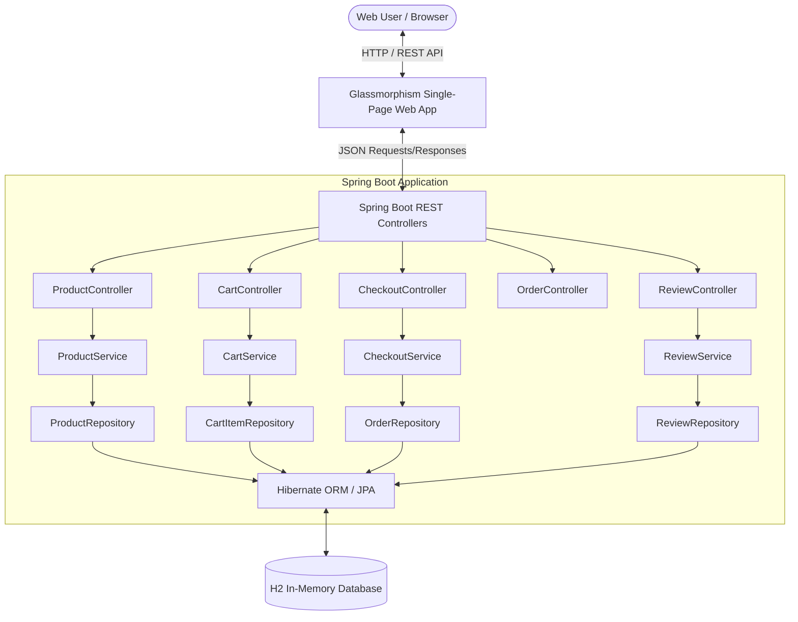

# 🛍️ CodecTech E-Commerce Platform

[](https://github.com/anshul-rautela)
[](https://www.oracle.com/java/)
[](https://spring.io/projects/spring-boot)
[](https://hibernate.org/)
[](https://www.h2database.com/)
[](LICENSE)

An enterprise-grade, full-stack **E-Commerce Application** developed for the **Codec Technologies Internship Task #6**. Built using **Java 21**, **Spring Boot 3.2**, **Hibernate (JPA)**, **REST APIs**, and an ultra-modern **Glassmorphism Web Interface**.

---

## 📌 Project Overview

- **Task**: Task #6 — E-Commerce Application
- **Description**: Design a basic e-commerce platform for browsing and purchasing products, featuring a product catalog, shopping cart, and payment simulation.
- **Technologies**: Java (Spring Boot), Hibernate, REST APIs, H2 Database, HTML5, Vanilla CSS3 (Glassmorphism), Vanilla JavaScript (ES6+).

---

## ✨ Core Features

### 🛒 Product Catalog & Discovery
- **Dynamic Product Grid**: Displays product imagery, stock availability badges, discount pricing, and customer ratings.
- **Search & Filtering**: Instant title/description keyword search, category pill navigation (`Audio & Sound`, `Smart Devices`, `Accessories`, `Home & Lifestyle`, `Fashion & Apparel`).
- **Sorting Options**: Sort by *Price: Low to High*, *Price: High to Low*, *Top Rated*, or *Newest Arrivals*.
- **Quick View Modal**: Inspect detailed product descriptions, stock counts, and user reviews without navigating away.

### 🛍️ Shopping Cart & Discount Engine
- **Session-Based Cart**: Persistent cart per user session (`sessionId`).
- **Quantity Management**: Incremental quantity stepper `[-] count [+]`, item removal, and full cart clearing.
- **Promo Code Engine**: Real-time discount calculations (e.g. `AURA20` for 20% discount).
- **Price Calculation**: Automated subtotal, discount, 5% sales tax, and total pricing calculations.

### 💳 3D Virtual Credit Card & Payment Gateway Simulation
- **Interactive Credit Card**: Real-time formatting of card numbers, expiry dates, and cardholder names on a visual 3D glassmorphic credit card.
- **Multi-Method Gateway**: Supports Credit/Debit Cards, Instant UPI QR Code, and 1-Click Sandbox Fast Payment options.
- **Payment Verification Flow**: 3-second animated bank authorization simulation with live status updates (*Encrypting AES-256*, *Contacting Banking Gateway*, *Verifying 3D Secure*).
- **Order Confirmation & Tracking**: Generates unique transaction IDs (e.g. `TXN-328FCD46`) and itemized receipts, saving order history to database.

### ⭐ Reviews & Ratings System
- Submit customer review comments and 1–5 star ratings.
- Recalculates product average rating and total review counts dynamically.

---

## 🏗️ System Architecture



---

## 🛠️ Technology Stack

| Layer | Technology |
| :--- | :--- |
| **Language** | Java 21 |
| **Framework** | Spring Boot 3.2.5 |
| **Persistence / ORM** | Hibernate 6 / Spring Data JPA |
| **Database** | H2 Database (In-Memory) |
| **Build Tool** | Apache Maven 3.8+ |
| **Frontend UI** | HTML5, Vanilla CSS3 (Glassmorphism Dark Mode), JavaScript (ES6) |
| **Icons & Fonts** | FontAwesome 6, Google Fonts (`Outfit`, `Plus Jakarta Sans`) |

---

## 🔌 REST API Documentation

### 📦 Product Endpoints
| Method | Endpoint | Description |
| :--- | :--- | :--- |
| `GET` | `/api/products` | Query catalog with optional `category`, `search`, `minPrice`, `maxPrice`, `sortBy` |
| `GET` | `/api/products/{id}` | Get product details by ID |
| `GET` | `/api/products/categories` | Retrieve list of product categories |
| `GET` | `/api/products/featured` | Fetch featured product list |

### 🛒 Shopping Cart Endpoints
| Method | Endpoint | Description |
| :--- | :--- | :--- |
| `GET` | `/api/cart?sessionId={id}&promoCode={code}` | Fetch cart items, subtotal, tax, discount, and grand total |
| `POST` | `/api/cart/add` | Add product to cart |
| `PUT` | `/api/cart/items/{id}` | Update quantity of cart item |
| `DELETE` | `/api/cart/items/{id}` | Remove item from cart |
| `DELETE` | `/api/cart/clear?sessionId={id}` | Empty user shopping cart |

### 💳 Checkout & Orders Endpoints
| Method | Endpoint | Description |
| :--- | :--- | :--- |
| `POST` | `/api/checkout/process` | Process order checkout and simulate payment gateway authorization |
| `GET` | `/api/orders/{orderNumber}` | Lookup order details by order reference number |
| `GET` | `/api/orders?sessionId={id}` | Retrieve order history for user session |

### ⭐ Reviews Endpoints
| Method | Endpoint | Description |
| :--- | :--- | :--- |
| `GET` | `/api/products/{id}/reviews` | Get customer reviews for product |
| `POST` | `/api/products/{id}/reviews` | Submit product review & update rating |

---

## 🚀 How to Run Locally

1. **Clone the Repository**:
   ```bash
   git clone https://github.com/anshul-rautela/swift-cart.git
   cd swift-cart
   ```

2. **Compile and Run**:
   ```bash
   mvn clean spring-boot:run
   ```

3. **Open in Browser**:
   - **Web Application**: `http://localhost:8080`
   - **H2 Database Console**: `http://localhost:8080/h2-console`
     - **JDBC URL**: `jdbc:h2:mem:ecomdb`
     - **Username**: `sa`
     - **Password**: *(leave blank)*

---

## 👨‍💻 Developer & Internship Credit

Developed by **Anshul Rautela** for the **Codec Technologies Internship**.
- **GitHub**: [@anshul-rautela](https://github.com/anshul-rautela)
- **Repository**: [CodecTech-ECommerce-Platform](https://github.com/anshul-rautela/swift-cart)
